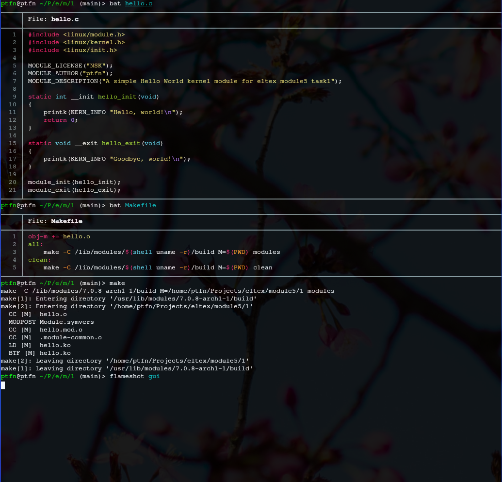
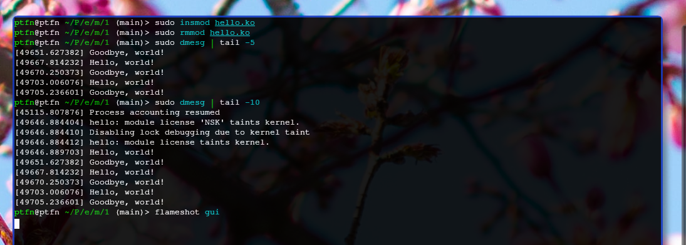
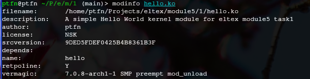

# Задание 1 — Hello World модуль

Взяли минимальный пример с The Geek Stuff. Файл `hello.c` содержит инициализацию и завершение модуля с выводом в dmesg.

После первого запуска добавили макросы `MODULE_LICENSE`, `MODULE_AUTHOR` и `MODULE_DESCRIPTION`, как требует задание.

## Сборка

Собираем модуль через Makefile, который обращается к заголовкам текущего ядра.

## Загрузка

Загружаем модуль `insmod` и проверяем вывод в `dmesg`.

## Информация о модуле

Смотрим метаданные модуля через `modinfo`.

