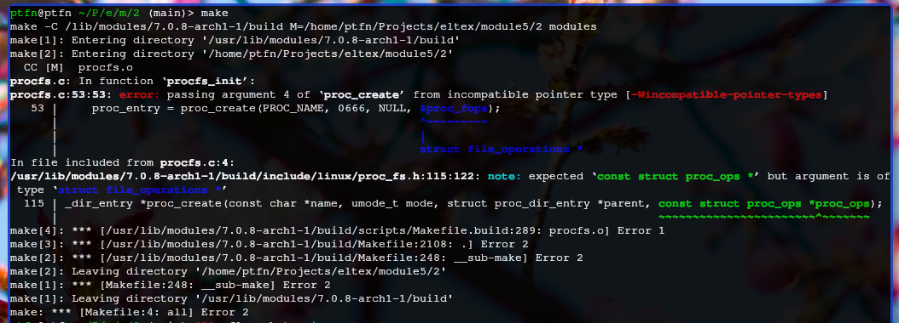
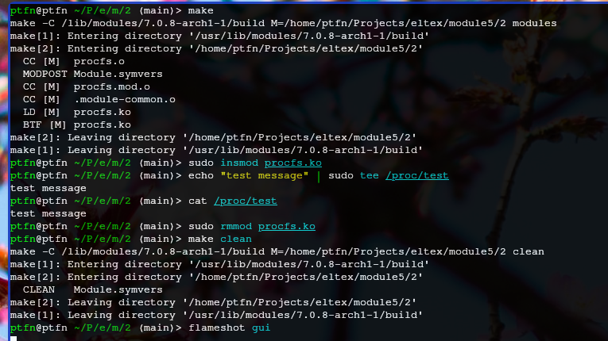
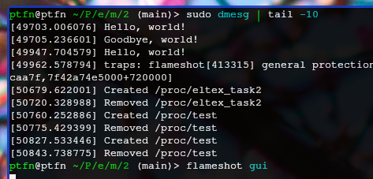

# Задание 2 — procfs модуль

## Ошбика при сборке

Взяли пример с `file_operations` (старый API для proc). На ядре 7.0.8 `proc_create` принимает `struct proc_ops`, а не `file_operations`. Сборка падает с ошибкой несовместимости типов.

## Адаптация под новое ядро

Заменили `struct file_operations` на `struct proc_ops`, поля переименовали:
- `.open` → `.proc_open`
- `.release` → `.proc_release`
- `.read` → `.proc_read`
- `.write` → `.proc_write`

После исправления модуль собрался без ошибок.

## Загрузка и проверка

Загружаем модуль, пишем данные через `/proc/eltex_task2`, читаем обратно. Проверяем сообщения модуля в dmesg.

