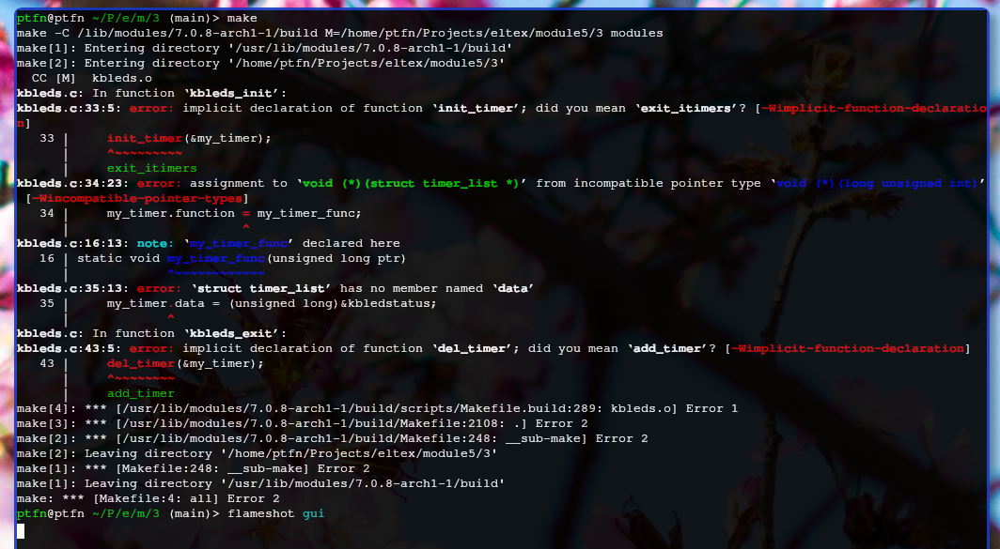
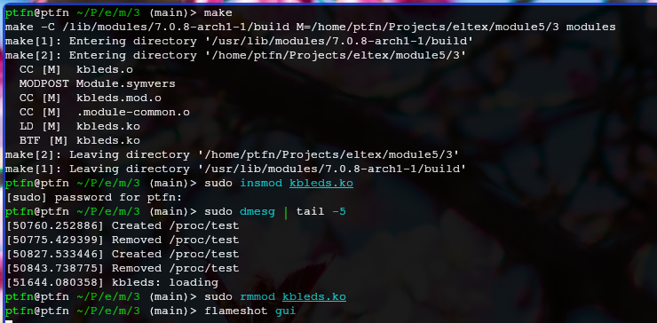
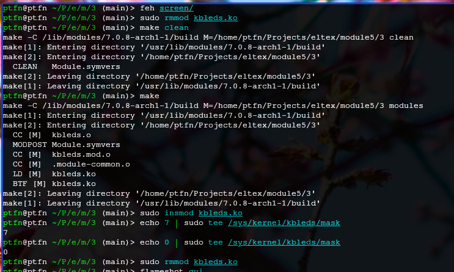
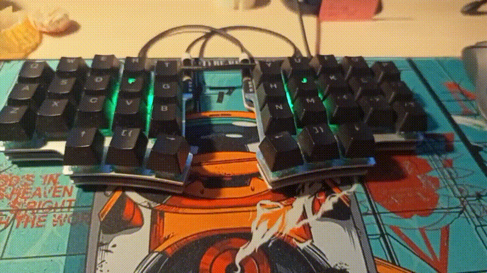

# Задание 3 — Мигание лампочек клавиатуры (kbleds)

Взяли пример с устаревшим API таймера (`init_timer`, `del_timer`, старая сигнатура callback). На ядре 7.0.8 этот API удалён — сборка падает с ошибками.

## Адаптация под новое ядро

Заменили устаревший API на современный:
- `init_timer` + прямая настройка полей → `timer_setup`
- `void (*)(unsigned long)` → `void (*)(struct timer_list *)`
- `del_timer` → `timer_delete_sync`
- Все глобальные переменные сделали `static`

Добавили sysfs с атрибутом `mask` в `/sys/kernel/kbleds/` для управления миганием.

## Работа модуля

Управление миганием через маску: 1 (Caps Lock), 2 (Num Lock), 4 (Scroll Lock), 7 (все). Значение 0 выключает мигание. Частота фиксированная.

