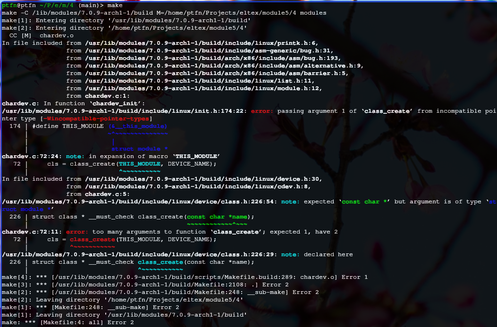
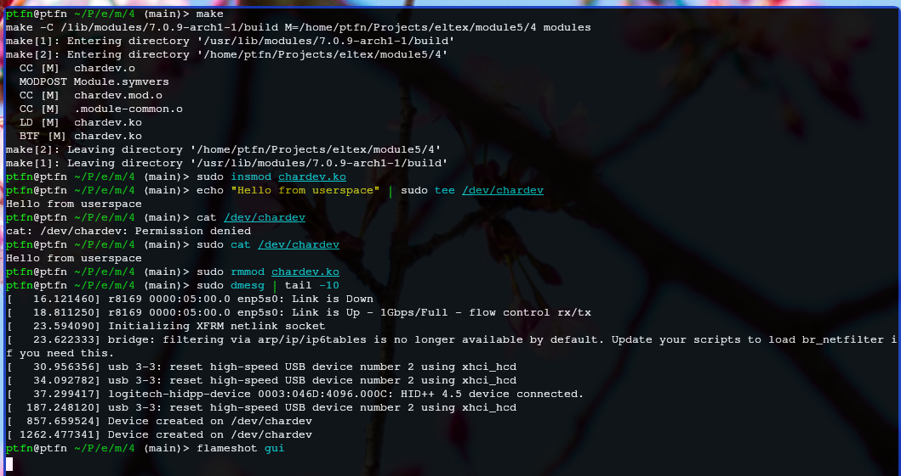

# Задание 4 — Символьное устройство (chardev)

Модуль создаёт символьное устройство `/dev/chardev` для обмена данными между ядром и userspace. Поддерживает чтение и запись.

Собираем модуль через Makefile. Первая версия с `class_create(THIS_MODULE, DEVICE_NAME)` не собралась — на ядре 7.0.8 функция принимает только имя класса.

Загружаем модуль, пишем данные через `/dev/chardev`, читаем обратно.

Данные, записанные в устройство, сохраняются во внутреннем буфере. При чтении буфер возвращается. При выгрузке модуля устройство `/dev/chardev` исчезает.
