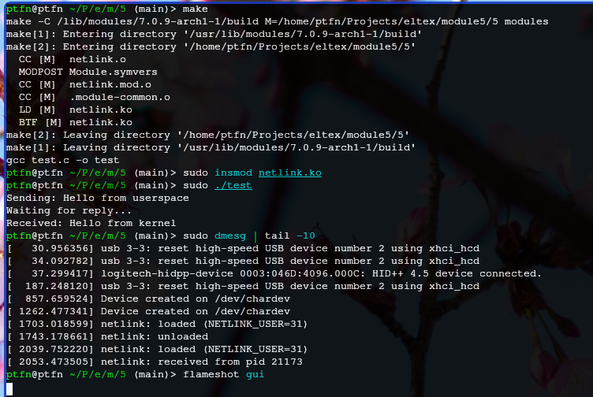

# Задание 5 — Netlink

Модуль обменивается данными с userspace через netlink-сокеты (протокол NETLINK_USER).

Собираем модуль и тестовую программу одной командой `make`.

Загружаем модуль, запускаем тестовую программу. Она отправляет ядру сообщение *Hello from userspace* и получает ответ *Hello from kernel*.
