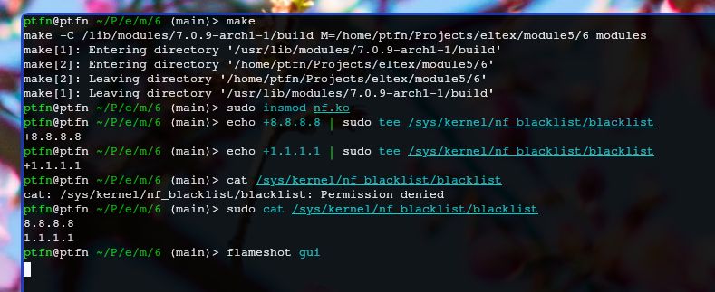
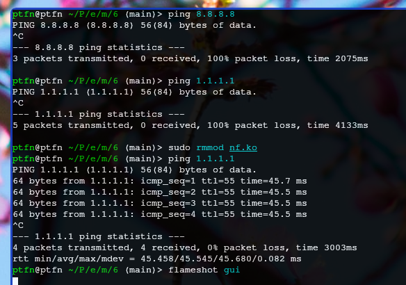

# Задание 6 — Netfilter IP blacklist

Модуль перехватывает исходящие пакеты (NF_INET_LOCAL_OUT) и сверяет IP назначения с чёрным списком. Если адрес в списке — пакет отбрасывается.

Управление списком через `/sys/kernel/nf_blacklist/blacklist`: запись `+IP` добавляет адрес, `-IP` удаляет, чтение показывает список.

## Сборка

Собираем модуль через Makefile.

## Загрузка и проверка

Загружаем модуль, добавляем IP в чёрный список, проверяем что пакеты к нему блокируются.

